## Table of Contents:
### HW1: Hello World!
The typical <b>"Hello World!"</b> code.

---

### HW2: Higher/Lower
A program that <b>guesses a number (you think of one first)</b>; if the computer is wrong, you tell it that your number is higher or lower until it guesses correctly. This assignment taught us how to intake & process user input, how to use while loops, and how to implement if/else statements.

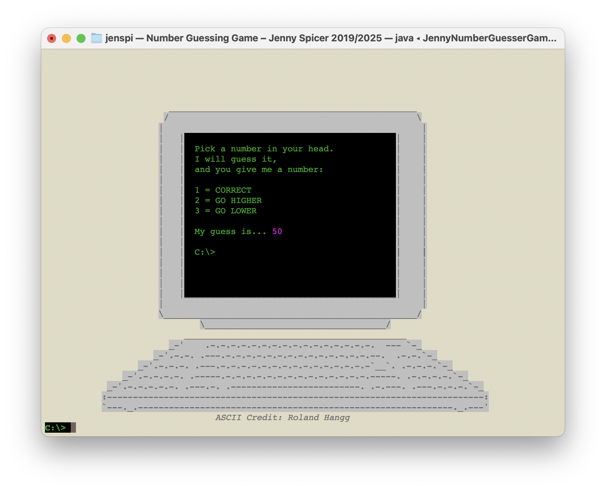 
<i>Higher/Lower</i>

---

### HW3: Combinations
Hard-coded program <b>finding the number of ways one hundred people can be put into a group of four</b>. A bonus file that does the same, but with five people instead. Although it's not the best way to go about this problem, this assignment was to get us familiar with for loops.
  

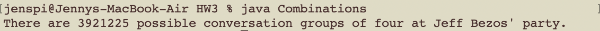 
<i>Combinations– 100 attendees, groups of 4 people.</i>

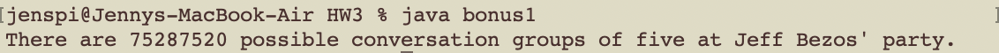 
<i>Combinations– 100 attendees, groups of 5 people.</i>

---

### HW4: Virtual Pet
A <b>tamagotchi-style program where you "find" a kitten, name it, and then take care of it</b>. I chose for the animal to be a kitten based on my beloved cat, June (I'm writing this readme four years post-assignment, and she has since passed away around two years ago. It warmed my heart to see that I included my dad's nickmane for her in my code, so I wanted to mention it here). The program <b>keeps track of all statistics and pets that you find</b>. This assignment had us practice arrays, constant variables, and implementing & calling our own written methods.

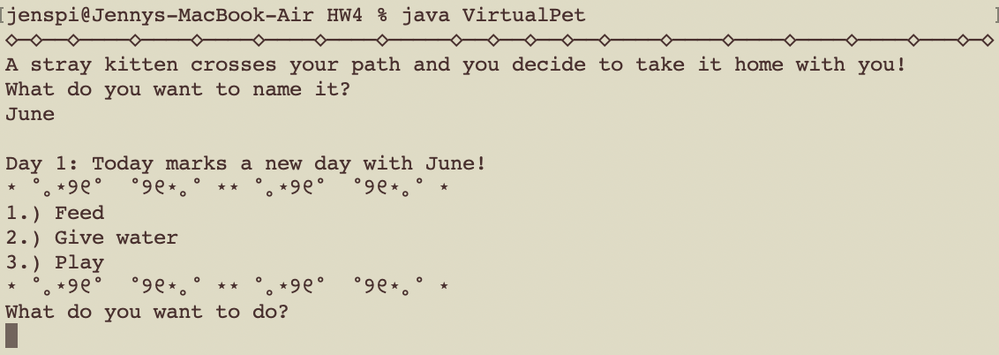 
<i>Virtual pet start</i>

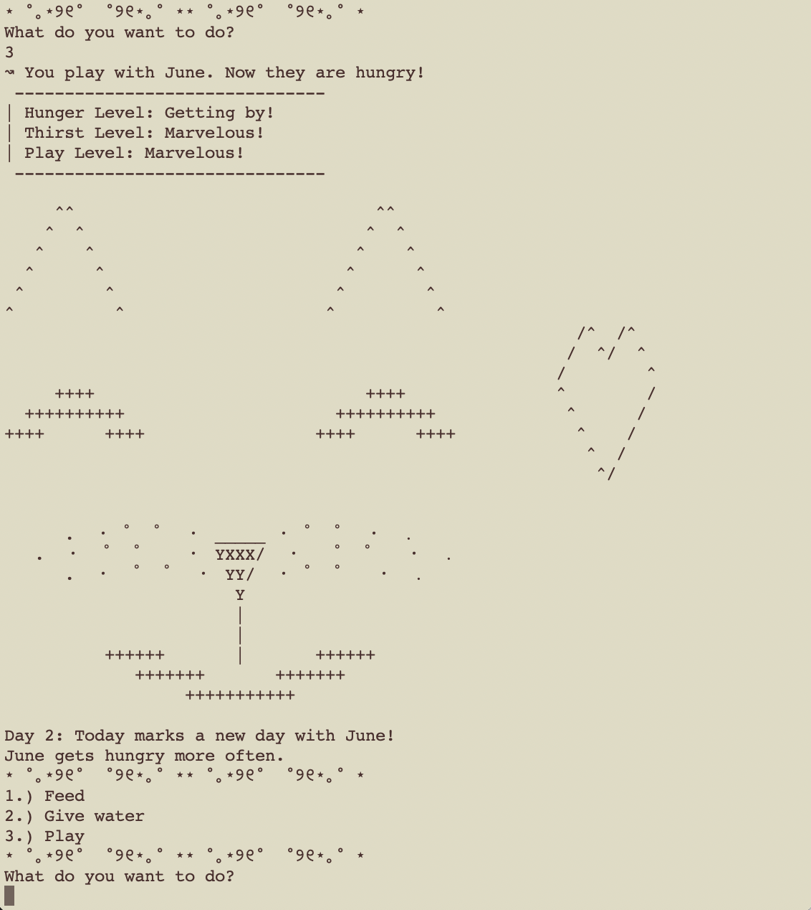 
<i>Virtual pet gameplay</i>

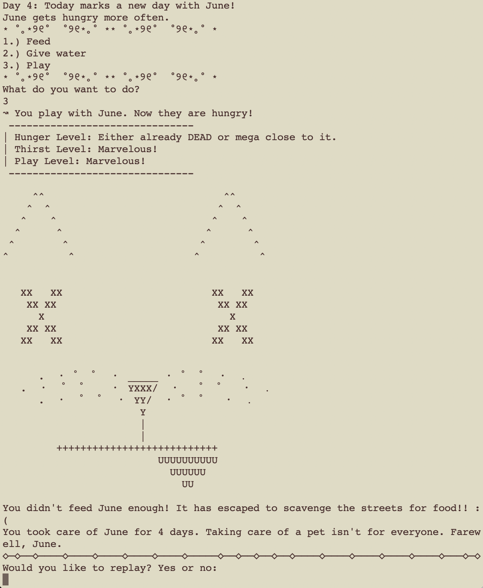 
<i>Virtual kitten deat– ahem– running away</i>

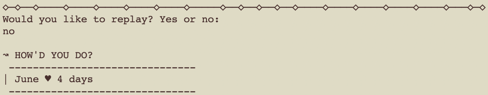 
<i>Statistics after game is over & player no longer wants new virtual kittens</i>

---

### HW5: Adventure Game
A <b>dungeon game based completely off of my family home</b>, with little details that may or may not be true til this day. This assignment was simply to implement our understanding of multidimensional arrays.

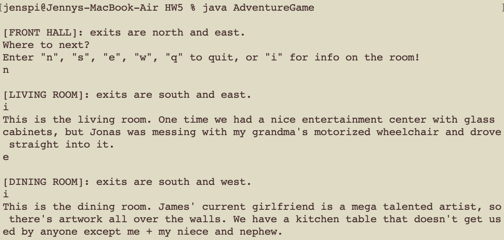 
<i>Adventure start</i>

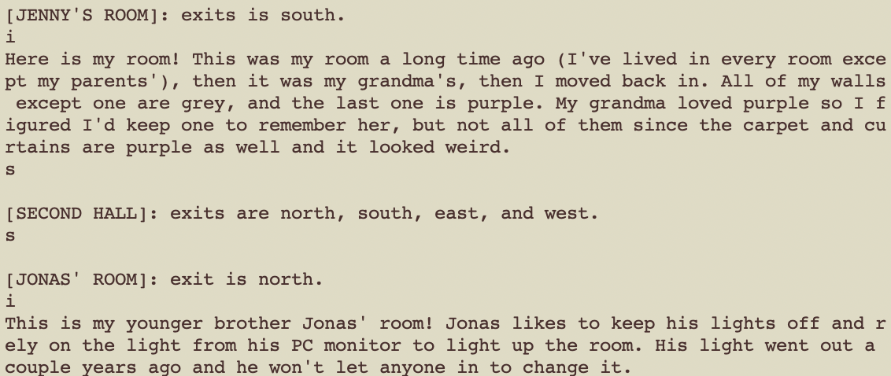 
<i>Adventure gameplay</i>

#### Preparation work

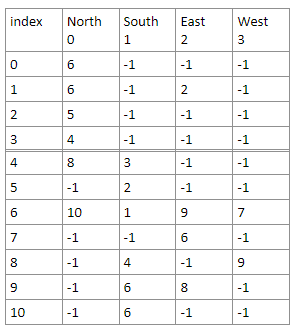 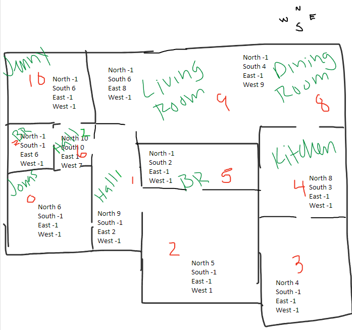 
<i>Grid-based game map & Sketch to help you get throught the house.</i>

<!-- //TODO: get sketch from yellow journal -->

---

### HW6: Art Museum
The user travels through an art museum, where each room has its own description and possible <b>hidden features</b>, such as <b>exiting through a window</b> but <b>not being able to enter back in that same way</b>. We learned how to make use of more than one class.

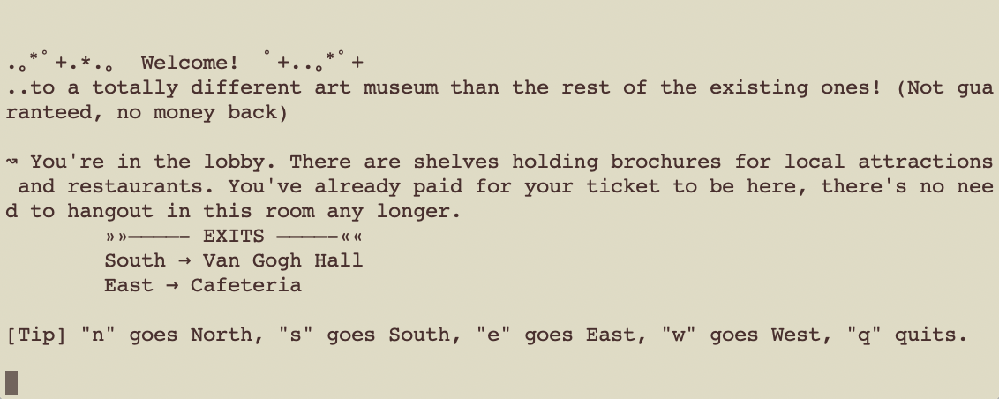 
<i>Art Museum start</i>

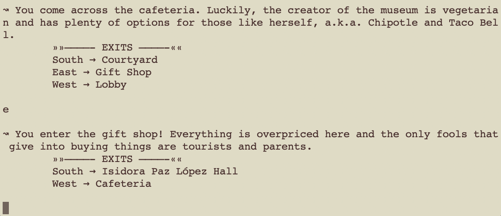 
<i>Art Museum gameplay, as usual</i>

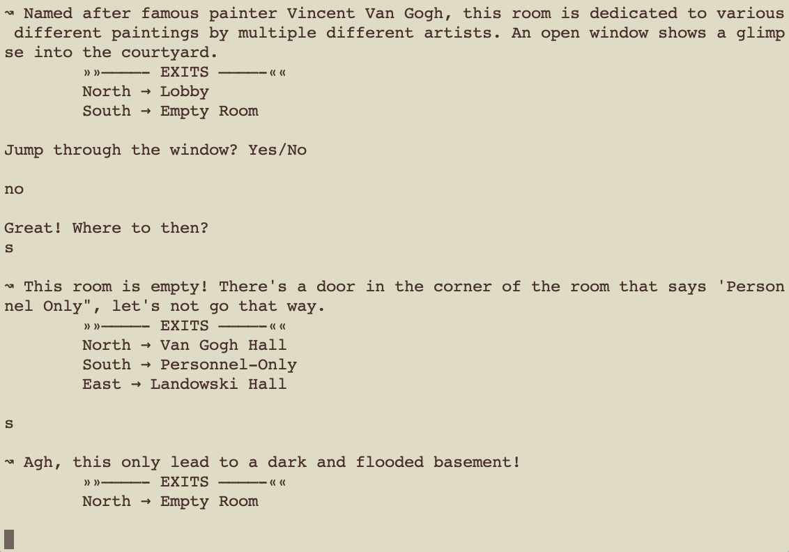 
<i>Art Museum gameplay, with player choosing options against the game's wishes</i>

<!-- //TODO: is there a sketch in yellow journal for this one? -->

---

### HW7: Art Museum (but with enemies!)
Our Art Museum assignment but with inheritance! This brought the addition of <b>enemies</b> & <b>friendlies</b>, as well as <b>interacive items to defend oneself</b> and <b>an inventory</b>.

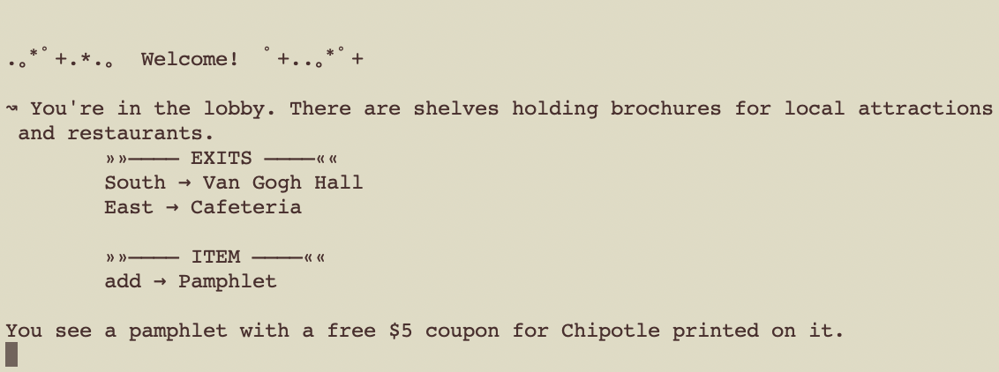 
<i>Advanced Art Museum start</i>

 
<i>Advanced Art Museum inventory system</i>

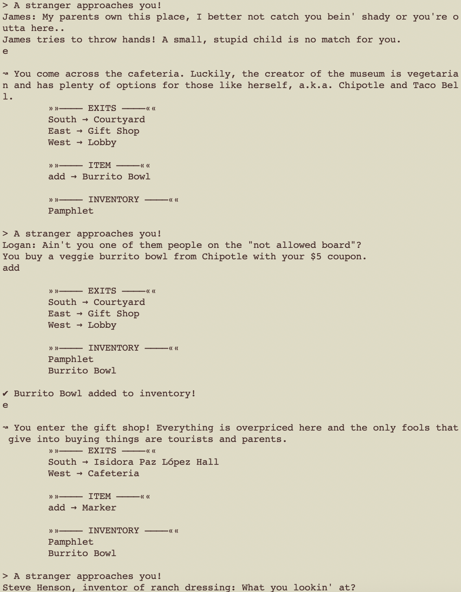 
<i>Advanced Art Museum enemy encounter</i>

<!-- //TODO: is there a sketch in yellow journal for this one? -->
---

### Course Information:
Fall 2019 @ (The) University of New Orleans

CSCI 1583 (Software Development I) with Dr. Samuel
